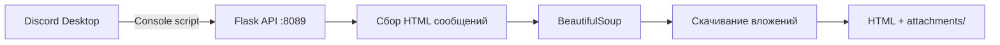

# Discord Messages Exporter

Утилита для экспорта переписки Discord в автономный HTML-файл с сохранением вложений (изображения, видео, файлы).

Работает через консоль разработчика в клиенте Discord: скрипт собирает сообщения из открытого чата и отправляет их локальному серверу, который формирует готовый архив.

## Возможности

- Экспорт истории чата в HTML с оформлением, близким к Discord
- Автоматическое скачивание вложений с `cdn.discordapp.com`
- Локальное хранение: все файлы сохраняются в папку `Exported_Chats/`
- Простой GUI на Tkinter с пошаговыми инструкциями
- Кнопка для включения DevTools в клиенте Discord (Windows)

## Требования

- **ОС:** Windows (основной сценарий; DevTools и пути к настройкам Discord рассчитаны на Windows)
- **Python:** 3.9+
- **Клиент Discord:** Desktop (Stable, PTB или Canary)
- Доступ к интернету для загрузки вложений

## Установка

1. Клонируйте репозиторий:

```bash
git clone https://github.com/milkycloud-dev/discord-messages-exporter.git
cd discord-messages-exporter
```

2. Установите зависимости:

```bash
pip install -r requirements.txt
```

Или запустите `start.bat` — он установит зависимости и запустит приложение.

## Использование

### 1. Запустите программу

```bash
python main.py
```

Откроется окно **Discord Chat Exporter**. Локальный сервер стартует на порту **8089**.

### 2. Включите DevTools в Discord

В окне программы нажмите **«Разблокировать DevTools в Discord»** и перезапустите Discord.

Если кнопка не сработала, включите режим разработчика вручную в настройках Discord.

### 3. Откройте нужный чат

В Discord перейдите в канал или личные сообщения, историю которых нужно сохранить.

### 4. Запустите экспорт

1. Нажмите `Ctrl + Shift + I`, чтобы открыть инструменты разработчика.
2. Перейдите на вкладку **Console**.
3. В программе нажмите **«Скопировать скрипт»** и вставьте содержимое в консоль Discord.
4. Нажмите `Enter`.

Скрипт начнёт прокручивать чат вверх и собирать сообщения. В правом верхнем углу Discord появится панель с количеством собранных сообщений.

### 5. Завершите экспорт

- Нажмите **«Остановить и Сохранить»** в панели Discord, или
- Дождитесь автоматического завершения, когда будет достигнуто начало чата.

Готовый файл и вложения появятся в папке:

```
Exported_Chats/<название_чата>/
├── <название_чата>.html
└── attachments/
    └── ...
```

## Как это работает



1. JavaScript-скрипт в консоли Discord находит сообщения и отправляет их на `http://127.0.0.1:8089`.
2. Flask принимает данные через эндпоинты `/init`, `/chunk`, `/finish`.
3. После завершения программа парсит HTML, скачивает медиа с CDN Discord и переписывает ссылки на локальные файлы.
4. Итоговый HTML можно открыть в любом браузере без подключения к Discord.

## API (локальный сервер)

| Метод | Путь     | Описание                          |
|-------|----------|-----------------------------------|
| GET   | `/ping`  | Проверка доступности сервера      |
| POST  | `/init`  | Инициализация экспорта (title, head) |
| POST  | `/chunk` | Приём пакета сообщений            |
| POST  | `/finish`| Запуск финальной сборки HTML      |

## Структура проекта

```
discord-messages-exporter/
├── main.py           # GUI, Flask-сервер, логика экспорта
├── requirements.txt  # Зависимости Python
├── start.bat         # Быстрый запуск под Windows
├── LICENSE           # MIT License
└── README.md
```

## Зависимости

| Пакет          | Назначение                    |
|----------------|-------------------------------|
| Flask          | Локальный HTTP-сервер         |
| flask-cors     | CORS для запросов из Discord  |
| BeautifulSoup4 | Парсинг и обработка HTML      |
| requests       | Скачивание вложений           |

## Ограничения и замечания

- Экспорт возможен только для чатов, к которым у вас есть доступ в клиенте Discord.
- Очень длинные истории могут занимать много времени из-за прокрутки и загрузки вложений.
- Антивирус или фаервол могут блокировать соединение между Discord и локальным сервером на порту 8089.
- Утилита не является официальным продуктом Discord и не связана с Discord Inc.
- Соблюдайте [Terms of Service Discord](https://discord.com/terms) и права других участников при экспорте переписки.

## Устранение неполадок

| Проблема | Решение |
|----------|---------|
| «Доступ к программе блокируется» | Убедитесь, что `main.py` запущен; проверьте антивирус и порт 8089 |
| «Сообщения не найдены» | Откройте нужный чат/канал до запуска скрипта |
| DevTools не открываются | Включите режим разработчика вручную или перезапустите Discord |
| Вложения не скачиваются | Проверьте интернет; ссылки CDN могут быть недоступны для старых сообщений |

## Лицензия

Проект распространяется под лицензией [MIT](LICENSE).
