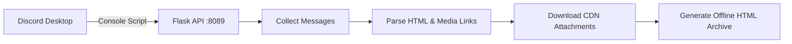

# Discord Messages Exporter

A utility to export Discord chat history into a standalone offline HTML file, preserving attachments (images, videos, and files).

The tool runs a local server and uses a script executed within the Discord developer console to collect and stream messages from an active chat session to a local directory.

---

## Features

* **HTML Export:** Formats exported history similarly to the native Discord interface.
* **Local Media Downloads:** Downloads and links images, videos, and files locally in `Exported_Chats/`.
* **User-Friendly GUI:** Built with Tkinter to provide quick setup instructions.
* **DevTools Access:** Includes a utility to enable DevTools within the Discord Desktop client (Windows).

---

## Requirements

* **OS:** Windows (preferred for automated DevTools configuration).
* **Python:** 3.9+
* **Discord Client:** Stable, PTB, or Canary desktop client.
* Internet connection (for downloading CDN attachments).

---

## Installation

1. Clone the repository:
   ```bash
   git clone https://github.com/milkycloud-dev/discord-messages-exporter.git
   cd discord-messages-exporter
   ```

2. Install dependencies:
   ```bash
   pip install -r requirements.txt
   ```
   *Alternatively, run `start.bat` on Windows to install dependencies and launch the app.*

---

## Usage

1. **Start the Exporter:**
   Run `python main.py`. The local Flask server will launch on port `8089`.

2. **Enable Discord DevTools:**
   Click **"Unlock DevTools in Discord"** in the GUI, then restart Discord. Alternatively, enable it manually in Discord configurations.

3. **Select Chat:**
   Open Discord and navigate to the chat or channel you wish to export.

4. **Run Console Script:**
   * Open DevTools (`Ctrl + Shift + I`) and go to the **Console** tab.
   * Click **"Copy Script"** in the exporter GUI.
   * Paste the script into the Discord console and press `Enter`.
   * The script will scroll and fetch messages automatically.

5. **Save Results:**
   Click **"Stop and Save"** in the floating overlay on Discord or wait until the beginning of the chat is reached. Output files are saved under `Exported_Chats/<chat_name>/`.

---

## Technical Architecture



---

## Project Structure

```
discord-messages-exporter/
├── main.py           # GUI & Flask server logic
├── requirements.txt  # Python package list
├── start.bat         # Windows bootstrap script
└── LICENSE           # MIT License
```

---

## License

This project is licensed under the **MIT License**.
