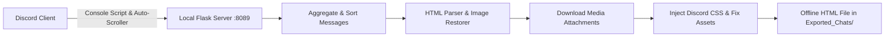

<p align="center">
  
</p>

<h1 align="center">Discord Messages Exporter</h1>

<p align="center">
  <b>A standalone utility to export Discord chat history into beautiful, pixel-perfect offline HTML archives with attachments and full styling preservation.</b>
</p>

<p align="center">
  <a href="#english"></a>
  <a href="#russian--русский"></a>
  
  
  
</p>

---

<a name="english"></a>
## 🇬🇧 English Documentation

### Overview

**Discord Messages Exporter** is a lightweight, non-intrusive desktop application that exports Discord channel conversations or direct messages into self-contained, offline-viewable HTML files. Unlike basic scrapers that produce broken layouts, this exporter faithfully reproduces the native Discord desktop user experience.

### Key Features

* **🎨 Pixel-Perfect Discord UI**: Authentic Discord dark theme (`#313338`), cozy message spacing, custom Nitro gradient prism display names, Google Inter fallback fonts, and custom Discord scrollbars.
* **✨ Avatar Decoration Alignment**: Avatar decorations (frames, animations, special effects) are aligned directly over profile avatars with absolute pixel accuracy.
* **📥 Local Media Downloader**: Automatically downloads attachments (images, audio, videos) from `cdn.discordapp.com` and `media.discordapp.net` into a dedicated local `attachments/` folder.
* **🖼️ Lazy-Loaded Image Recovery**: Recovers and embeds full-resolution images from anchor links (`<a>`) even when Discord DOM virtualization unloaded the `` tags before export.
* **🕒 Clean Timestamps**: Strips redundant screen-reader accessibility text and displays clear timestamps, including left-gutter timestamps that appear on hover for consecutive messages.
* **🌐 Offline Asset Resolution**: Resolves Discord emoji and SVG icon paths so all emojis and interface icons render seamlessly offline.
* **🗣️ Bilingual GUI**: Native Tkinter user interface with real-time switching between **English (default)** and **Russian**.
* **⚡ One-Click DevTools Unlocker**: Automatically enables Developer Mode / DevTools across Discord Stable, PTB, and Canary client installations on Windows.
* **🤖 In-Discord HUD Overlay**: The injected console script provides a floating on-screen HUD displaying real-time message collection counts and a manual **"Stop & Save"** button.

### System Requirements

* **Operating System**: Windows 10 / 11
* **Python**: 3.9 or newer
* **Discord Client**: Official Discord Desktop client (Stable, PTB, or Canary)
* **Network**: Internet connection (required during export to download CDN attachments)

### Installation

1. **Clone the repository:**
   ```bash
   git clone https://github.com/milkycloud-dev/discord-messages-exporter.git
   cd discord-messages-exporter
   ```

2. **Install Python dependencies:**
   ```bash
   pip install -r requirements.txt
   ```
   *(Or simply double-click `start.bat` on Windows to install dependencies and launch automatically)*

### Usage Guide

1. **Launch the Application**:
   Run `python main.py` or double-click `start.bat`. The local server starts on `http://127.0.0.1:8089`.
2. **Unlock DevTools**:
   Click **"Unlock DevTools in Discord"** in the app window, then restart your Discord client.
3. **Open Target Chat**:
   In Discord, open the direct message or channel you want to archive.
4. **Copy & Run Script**:
   * Press `Ctrl + Shift + I` in Discord to open DevTools, then switch to the **Console** tab.
   * In the Exporter app, click **"📋 Copy Exporter Script"**.
   * Paste the script into the Discord Console and press `Enter`.
5. **Collect & Save**:
   * The script automatically scrolls upward to fetch history while displaying a floating HUD.
   * Click **"🛑 Stop & Save"** at any moment, or let it scroll until the chat origin is reached.
   * The finalized archive and attachments are saved under `Exported_Chats/<chat_title>/`.

### Architecture



### 📄 License

This software is distributed under a strict **Proprietary Software License**. All rights are reserved by MilkyCloud. Unauthorized copying, reproduction, distribution, modification, or commercial exploitation is strictly prohibited. See [`LICENSE`](LICENSE) for complete terms.

---

<a name="russian--русский"></a>
## 🇷🇺 Русскоязычная документация

### Описание

**Discord Messages Exporter** — это удобное настольное приложение для сохранения истории переписки Discord (личных сообщений и каналов) в виде автономных HTML-файлов. В отличие от стандартных парсеров, данный инструмент полностью воссоздает аутентичный визуальный интерфейс Discord.

### Основные возможности

* **🎨 Аутентичный интерфейс Discord**: Точное воспроизведение тёмной темы Discord (`#313338`), комфортный интервал сообщений (Cozy View), поддержка градиентных ников Nitro Prism, скругления блоков и фирменные скроллбары.
* **✨ Идеальное позиционирование украшений профиля**: Украшения аватаров (рамки, эффекты, космические звезды) точно центрируются поверх круга аватара без сдвигов и отрывов.
* **📥 Локальная загрузка вложений**: Автоматическое скачивание всех прикрепленных файлов (изображений, видео, аудио) из `cdn.discordapp.com` и `media.discordapp.net` в локальную папку `attachments/`.
* **🖼️ Восстановление виртуализированных изображений**: Автоматически извлекает и вставляет полноразмерные изображения из тегов-ссылок (`<a>`), даже если Discord выгрузил теги `` из виртуального DOM перед экспортом.
* **🕒 Аккуратные временные метки**: Устранены повторяющиеся даты скринридеров; компактные временные метки аккуратно всплывают в левой колонке при наведении на последовательные сообщения.
* **🌐 Офлайн-разрешение SVG и эмодзи**: Преобразует относительные пути иконок и смайлов в прямые ссылки на CDN, предотвращая ошибки 404 при просмотре без интернета.
* **🗣️ Двуязычный интерфейс**: Переключение между **английским (по умолчанию)** и **русским** языками в один клик прямо в окне программы.
* **⚡ Разблокировка DevTools в один клик**: Автоматически включает консоль разработчика в клиентах Discord Stable, PTB и Canary на Windows.
* **🤖 Плавающий оверлей в Discord**: Скрипт отображает интерактивный виджет со счётчиком собранных сообщений и кнопкой ручной остановки **«🛑 Остановить и сохранить»**.

### Системные требования

* **Операционная система**: Windows 10 / 11
* **Версия Python**: 3.9 или выше
* **Клиент Discord**: Официальный настольный клиент Discord (Stable, PTB или Canary)
* **Сеть**: Подключение к интернету (для загрузки вложений с серверов CDN)

### Установка

1. **Клонируйте репозиторий:**
   ```bash
   git clone https://github.com/milkycloud-dev/discord-messages-exporter.git
   cd discord-messages-exporter
   ```

2. **Установите зависимости:**
   ```bash
   pip install -r requirements.txt
   ```
   *(Или запустите файл `start.bat` в Windows для автоматической установки и запуска)*

### Инструкция по использованию

1. **Запустите программу**:
   Запустите `python main.py` или откройте `start.bat`. Локальный сервер начнет работу на порту `8089`.
2. **Разблокируйте DevTools**:
   Нажмите кнопку **«Разблокировать DevTools в Discord»** в окне программы и перезапустите Discord.
3. **Откройте нужный чат**:
   В Discord перейдите в диалог или канал, переписку которого хотите сохранить.
4. **Скопируйте и выполните скрипт**:
   * Нажмите `Ctrl + Shift + I` в Discord для открытия панели разработчика и перейдите на вкладку **Console**.
   * В окне программы нажмите **«📋 Скопировать скрипт»**.
   * Вставьте скопированный код в консоль Discord и нажмите `Enter`.
5. **Сбор и сохранение**:
   * Скрипт начнет автоматически прокручивать историю сообщений вверх.
   * Нажмите **«🛑 Остановить и сохранить»** в любой момент или дождитесь достижения самого начала переписки.
   * Готовый архив и вложения будут сохранены в папку `Exported_Chats/<название_чата>/`.

---

## 📁 Структура проекта / Project Structure

```
discord-messages-exporter/
├── assets/
│   └── logo.png          # Официальный логотип проекта / Project logo
├── main.py               # Серверная логика, Tkinter GUI и шаблонизатор экспорта
├── requirements.txt      # Список зависимостей Python
├── start.bat             # Скрипт быстрого запуска для Windows
├── .gitignore            # Защита приватных данных и экспортированных чатов
├── LICENSE               # Строгая проприетарная лицензия / Proprietary License
└── README.md             # Документация (EN & RU)
```

---

## 📄 Лицензия / License

Программное обеспечение распространяется на условиях **строгой проприетарной лицензии (Proprietary Software License)**. Все права защищены MilkyCloud. Копирование, распространение, модификация и коммерческое использование исходного кода строго запрещены без предварительного письменного согласия правообладателя. См. [`LICENSE`](LICENSE) для подробностей.

